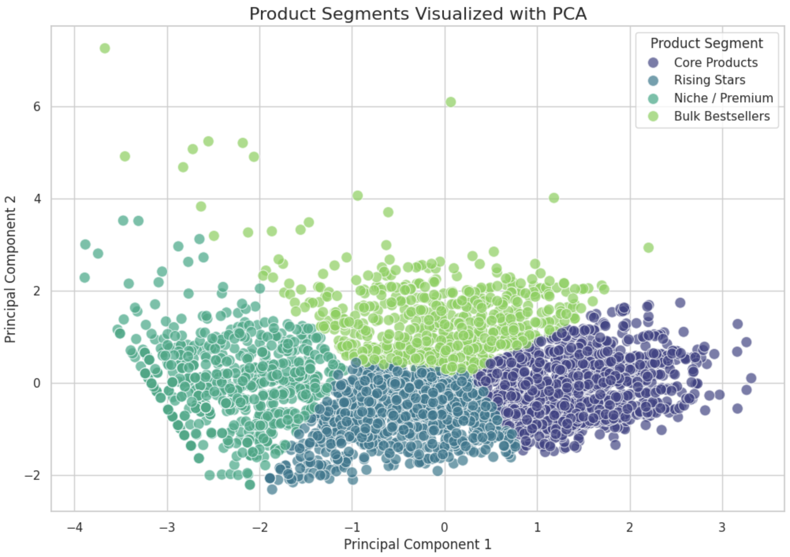
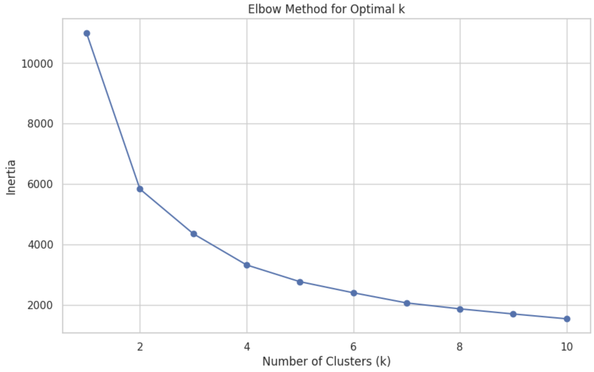
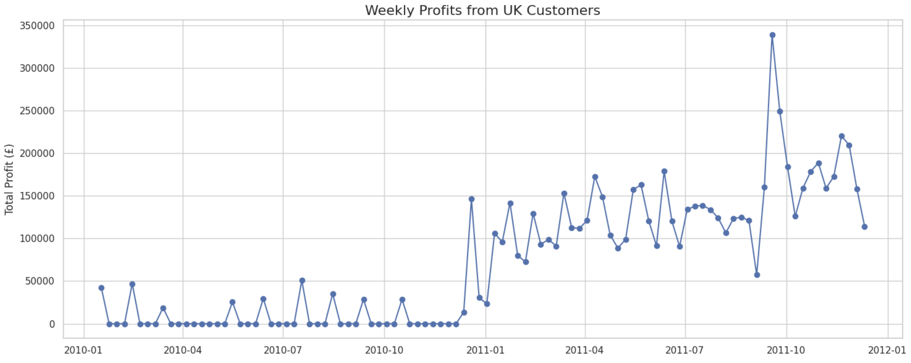

# E-Commerce Customer & Product Analysis

## 📝 Project Overview

This project analyzes an e-commerce dataset of a UK-based online retailer specializing in unique all-occasion gifts. The dataset contains transaction data from December 2023 to December 2024.

The primary goals of this project are:
1.  To answer specific business questions related to product returns, sales trends, and order sizes.
2.  To perform customer segmentation by grouping products into distinct categories based on their sales patterns, price, and popularity.

This analysis provides valuable insights that can help the business optimize inventory, tailor marketing strategies, and improve overall profitability.

---

## 📂 Repository Structure

-   `Assets`: Visualizations.
-   `Online Retail.xlsx`: The raw dataset used for the analysis.
-   `README.md`: This file provides an overview of the project.
-   `ecommerce_analysis.ipynb`: The main Jupyter Notebook containing all the Python code, analysis, visualizations, and detailed explanations.
-   `requirements.txt`: A list of the necessary Python libraries to run the notebook.

---

## 🚀 How to Run

1.  **Clone the repository:**
    ```bash
    git clone <your-repository-url>
    cd <repository-folder>
    ```

2.  **Install the required libraries:**
    ```bash
    pip install -r requirements.txt
    ```

3.  **Launch Jupyter Notebook:**
    ```bash
    jupyter notebook
    ```
4.  Open the `ecommerce_analysis.ipynb` file on Google Colab and run the cells. **Asegúrate de que el archivo `Online Retail.xlsx` esté en la misma carpeta.**






---

## 📊 Key Findings & Report

### Business Insights
* **Top Returned Item**: The item returned most frequently is "Manual". This suggests it might be a miscellaneous code used for adjustments.
* **UK Sales Trends**: UK profits show strong seasonality, peaking in the last quarter (Q4) leading up to the holiday season.
* **Order Size Comparison**: Orders from outside the United Kingdom are, on average, significantly larger than domestic orders.

### Product Segmentation
Using K-Means clustering, we grouped products into four distinct categories:
* **Core Products**: Low-priced, high-volume sellers.
* **Niche/Premium**: High-priced but sold in very low quantities.
* **Rising Stars**: Moderately priced and sold in good quantities.
* **Bulk Bestsellers**: Low-priced items sold in extremely high volumes to wholesalers.
